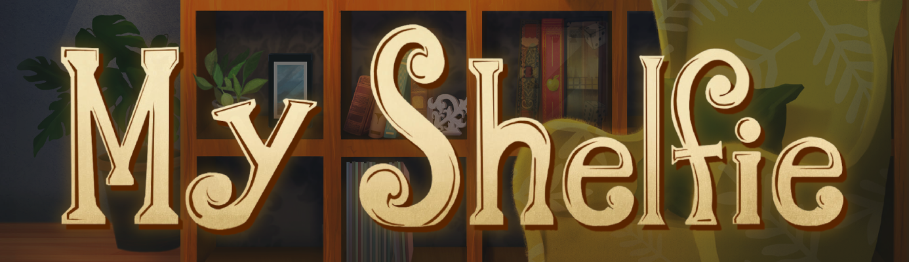

My Shelfie Board Game is the final test of **"Software Engineering"**, course of **"Computer Science Engineering"** held at Politecnico di Milano (2022/2023).

You can find the full game [here](https://www.craniocreations.it/prodotto/my-shelfie).

**Professor**: Prof. Gianpaolo Cugola


**Group**: GC35

**Students**:
- Tommaso Trabacchin 
- Melanie Tonarelli
- Emanuele Valsecchi
- Adem Shehi

## Project Specification
The project consists of a Java version of the board game *My Shelfie*, made by Cranio Creations, according to the game rulebook available in [italian version](src/main/resources/it.polimi.ingsw/rulebook/Rulebook_ITA_My-Shelfie.pdf) and [english version](src/main/resources/it.polimi.ingsw/rulebook/MyShelfie_Rulebook_ENG.pdf).

The program is realized following a Model-View-Controller design pattern: several UML diagrams are provided to clarify the structure and dynamics of the code.

Project requirements are available [here](src/main/resources/it.polimi.ingsw/rulebook/requirements.pdf).

## Implemented features

| Feature                  | Implemented                                                                       |
|--------------------------|-----------------------------------------------------------------------------------|
| All the rules            | ✅                                                                 |
| TUI                      | ✅                                                                 |
| GUI                      | ✅                                                                 |
| Socket                   | ✅                                                                |
| RMI                      | ✅                                                                |
| Advanced functionality 1 | ✅ Multiple matches                     |
| Advanced functionality 2 | ✅ Resilience to disconnections  |
| Advanced functionality 3 | ✅ Chat                                                            |
| Advanced functionality 4 | ⛔ Persistence                                                            |

## How to run the game
Firstly, download the jar from the following [link](https://drive.google.com/drive/folders/1CzPkN57-Kl8FTOIjUrhLuI9CXQdjTPhN?usp=sharing).
We weren't able to upload the jars in GitHub because they exceeded the allowed maximum file size. 
### Server
To execute Server please run the following command
```
java -jar server.jar localIP rmiPort socketPort turnDuration timeOut
```
where:
* ``` localIP ``` : Local IP of the machine that host the server.
* ```rmiPort ``` : RMI port number.
* ```socketPort ``` : Socket port number.
* ```turnDuration ``` : The maximum duration of a game turn (associated with a single player) in milliseconds.
* ```timeOut ``` : Duration in milliseconds after which the connection is considered lost.

Please, note that RMI port and socket port have to be different.

### Client
To execute Client please run the following command
```
java -jar client.jar tui|gui timeOut localIP
```
where:
* ``` tui|gui ``` : ``` tui ``` or ```gui ``` depending on which user interface the user wants to use.
* ```timeOut ``` : Duration in milliseconds after which the connection is considered lost.
* ``` localIP ``` : Local IP of the machine that host the client.

In order to run the GUI, `openJFX` is required.

## UML diagrams
The structure of the whole system is displayed by different UMLs. In the `deliveries/uml` directory, there are two subdirectories:
1. `handcraftedUML` which contains the initial handcrafted diagrams, such as:
    - [model class diagram](deliveries/uml/handcraftedUML/handcrafted_model_class_diagram.png);
    - [controller class diagram](deliveries/uml/handcraftedUML/handcrafted_controller_class_diagram.png);
    - [network sequence diagrams](deliveries/uml/handcraftedUML/sequence-diagrams).
2. `finalUML` which contains the final diagram, generated from the code by automated tools.

## Testing
The tests achieved the following coverage:
1. Model 

2. Controller
   


## JavaDoc
The following documentation includes a description of all classes and methods: [javadoc](deliveries/javadoc).

## Libraries and Plugins
| Library/Plugin | Description                                                                   |
|----------------|-------------------------------------------------------------------------------|
| __Maven__      | A build automation tool used primarily for Java projects.                     |
| __JavaFx__     | A Java library that is used to develop Desktop applications                   |
| __JUnit__      | A unit testing framework for Java programming language.                       |
| __Gson__       | A simple Java-based library to serialize Java objects to JSON and vice versa. |


## License
[My Shelfie](https://www.craniocreations.it/prodotto/my-shelfie) is property of [Cranio Creations](https://www.craniocreations.it) and all the copyrighted graphical assets used in this project were supplied by [Politecnico di Milano](https://www.polimi.it) in collaboration with their rights' holders.